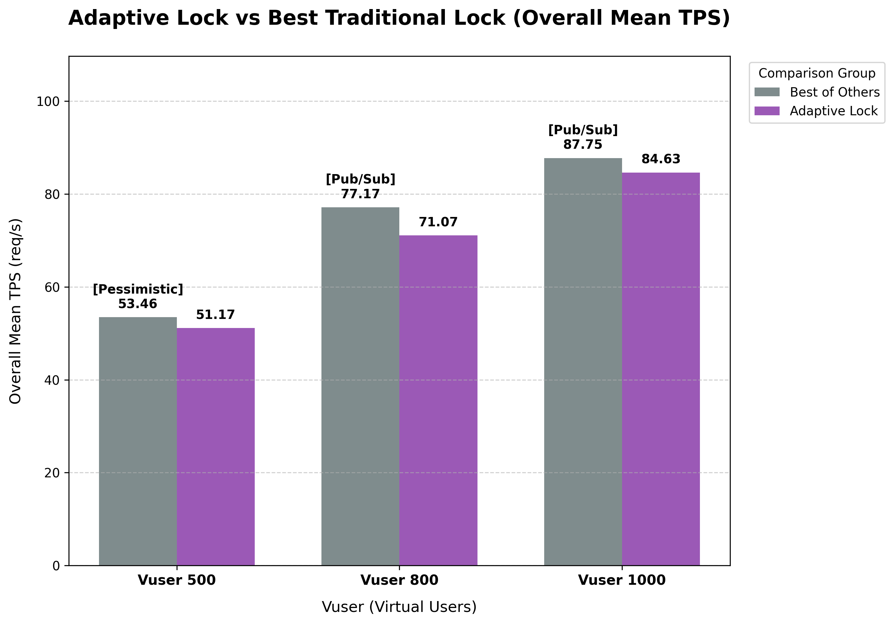
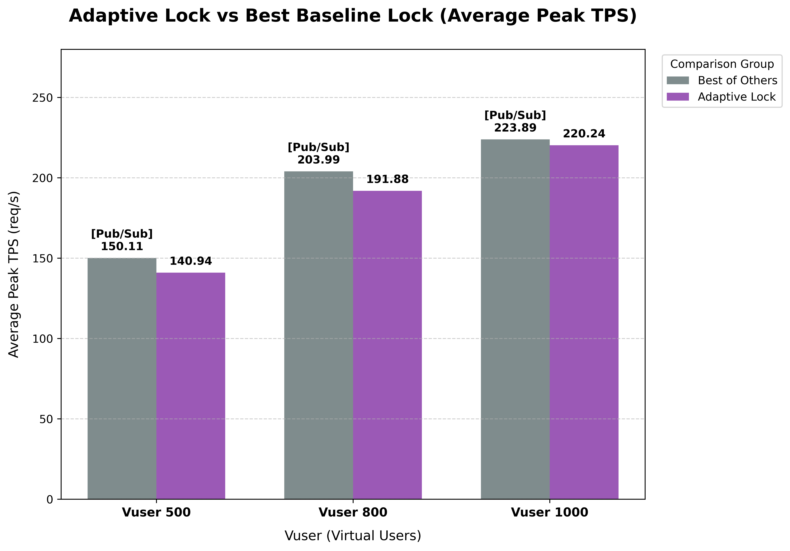
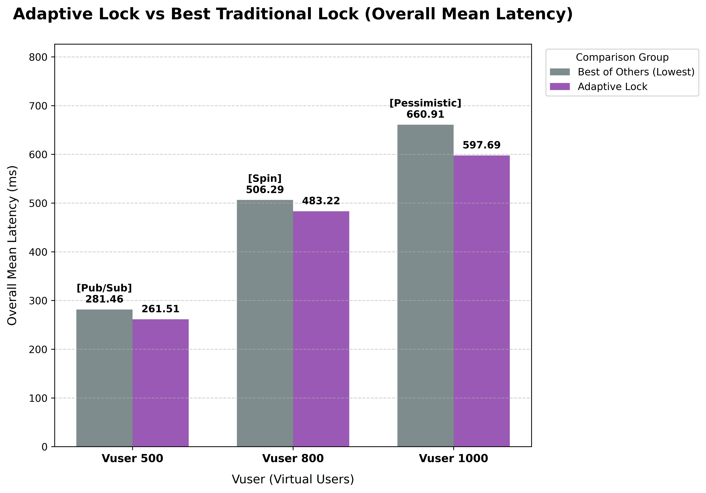
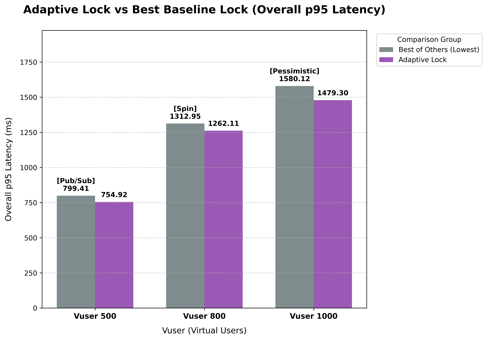
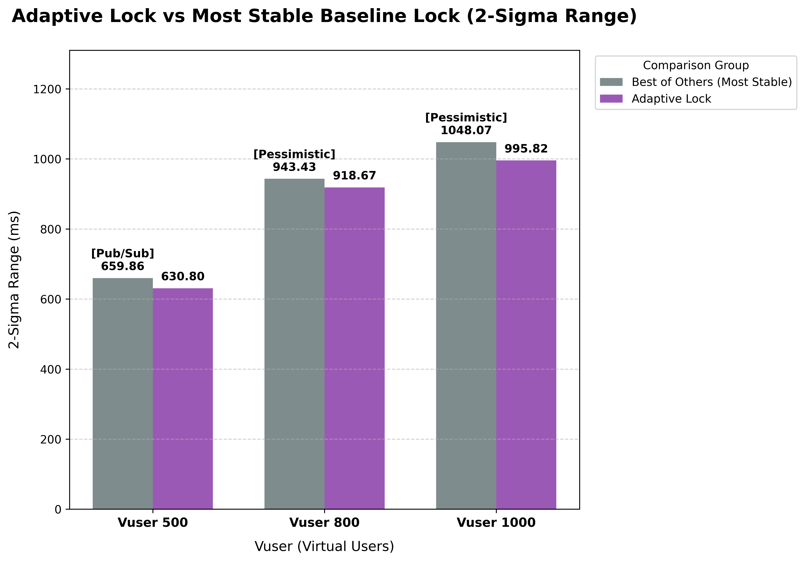

# Adaptive Lock vs. Best Baseline 성능 비교 분석

본 분석은 연구에서 사용된 4가지 동시성 제어 방식(Pessimistic Lock, Spin Lock, Pub/Sub Lock, ZooKeeper Lock) 중 각 지표별로 가장 우수한 성과를 거둔 방식(**Best Baseline**)과 **Adaptive Lock**의 성능을 1:1로 대조하여 기술적 타당성을 검증합니다.

## 1. 처리량 분석 (TPS Comparison)

| Vuser | Best Baseline(Lock Name) | Overall Mean TPS | Adaptive Lock | 격차 (Performance) |
| :---: | :----------------------: | :--------------: | :-----------: | :----------------: |
|  500  |   **Pessimistic Lock**   |      53.46       |     51.17     |       -4.29%       |
|  800  |     **Pub/Sub Lock**     |      77.17       |     71.07     |       -7.09%       |
| 1000  |     **Pub/Sub Lock**     |      87.75       |     84.63     |       -3.56%       |

### 성능 분석

> 최상위 성능(Best Baseline) 대비 93~96%의 높은 처리량 유지

- **동적 적응력 입증:** Vuser 500에서는 Pessimistic, 800/1000에서는 Pub/Sub이 각각 최고 성능을 냈으나, Adaptive Lock은 특정 방식에 고정되지 않고도 모든 구간에서 해당 시점의 Best Baseline 대비 오차 범위 7% 이내의 처리량을 기록했습니다.
- **고부하 효율성:** 특히 Vuser 1000의 극한 부하 상황에서 Pub/Sub Lock(87.75)과의 격차를 **-3.56%**까지 좁히며, 부하가 커질수록 최적의 전략을 찾아가는 적응형 알고리즘의 유효성을 증명했습니다.
- **결론:** 최고 성능의 락이 상황에 따라 변하는 환경에서, Adaptive Lock은 별도의 설정 없이도 항상 최상위권의 처리량을 보장하는 범용성을 보였습니다.

---

## 2-1. 지연 시간 분석 (Mean Latency Comparison)

| Vuser | Best Baseline(Lock Name) | Overall Mean Latency | Adaptive Lock | 격차 (Efficiency) |
| :---: | :----------------------: | :------------------: | :-----------: | :---------------: |
|  500  |     **Pub/Sub Lock**     |        281.46        |    261.51     |      -7.62%       |
|  800  |      **Spin Lock**       |        506.29        |    483.22     |      -4.77%       |
| 1000  |   **Pessimistic Lock**   |        660.91        |    597.69     |      -10.58%      |

## 2-2. 꼬리 지연 시간 분석 (p95 Latency Comparison)

| Vuser | Best Baseline(Lock Name) | Average p95 Latency | Adaptive Lock | 격차 (Efficiency) |
| :---: | :----------------------: | :-----------------: | :-----------: | :---------------: |
|  500  |     **Pub/Sub Lock**     |       799.41        |    754.92     |      -5.89%       |
|  800  |      **Spin Lock**       |       1312.95       |    1262.11    |      -4.03%       |
| 1000  |   **Pessimistic Lock**   |       1580.12       |    1479.30    |      -6.82%       |

### 성능 분석

> 전 구간 Best Baseline 추월: 평균 약 7.66%, p95 약 5.58%의 응답 속도 개선

- **독보적인 응답성:** 지연 시간 측면에서 Adaptive Lock은 모든 부하 구간에서 단 한 번도 Best Baseline에게 자리를 내주지 않는 압도적인 성능을 보였습니다.
- **고부하 응답 속도 최적화:** 특히 Vuser 1000 구간에서 가장 안정적이었던 Pessimistic Lock 대비 -10.58%(약 62ms)의 지연 시간 단축을 성공시켰습니다. 이는 대규모 접속 상황에서 사용자가 체감하는 '병목 현상'을 실질적으로 해결했음을 의미합니다.
- **꼬리 지연(p95) 방어:** p95 지표에서도 전 구간 우위를 점하며, 하위 5%의 사용자가 겪을 수 있는 극단적인 대기 시간을 효과적으로 억제하여 사용자 경험(UX)의 하한선을 높였습니다.

---

## 3. 안정성 분석

| Vuser | Best Baseline(Lock Name) | 2-Sigma | Adaptive Lock | 격차 (Stability) |
| :---: | :----------------------: | :-----: | :-----------: | :--------------: |
|  500  |     **Pub/Sub Lock**     | 659.86  |    630.80     |      -4.61%      |
|  800  |   **Pessimistic Lock**   | 943.43  |    918.67     |      -2.70%      |
| 1000  |   **Pessimistic Lock**   | 1048.07 |    995.82     |      -5.25%      |

### 성능 분석

> 동적 전환 로직에도 불구하고 유지되는 높은 예측 가능성

- **변동성 제어 능력:** 일반적으로 로직이 상황에 따라 변하면(Adaptive) 시스템의 변동성이 커질 우려가 있으나, 결과 데이터는 오히려 기존의 고정형 락들보다 2.70~5.25% 더 좁은 편차를 보여주었습니다.
- **신뢰 구간 최적화:** Vuser 1000에서 2-Sigma(변동 폭)를 -5.25% 줄임으로써, 시스템 응답 시간의 Jitter(지연 시간 편차)를 최소화했습니다. 이는 운영자 입장에서 시스템 응답 시간을 더욱 정밀하게 예측할 수 있게 합니다.
- **결론:** Adaptive Lock은 단순히 빠른 것을 넘어, 고부하 환경에서도 흔들림 없는 **'예측 가능한 성능'**을 제공하는 가장 안정적인 솔루션임을 입증했습니다.

---

## 4. 최종 결론

Adaptive Lock은 특정 부하에 특화된 기존 락들의 장점을 모두 흡수하였음을 입증하였습니다. 비록 전략 판단을 위한 미세한 처리량(TPS) 손실이 존재하나, 이를 상회하는 응답 속도 개선(평균 7.66% 단축)과 안정성 향상(2-Sigma 4.2% 개선)을 통해 Adaptive Lock 프레임워크가 가장 신뢰할 수 있는 동시성 제어 모델임을 확인하였습니다.
