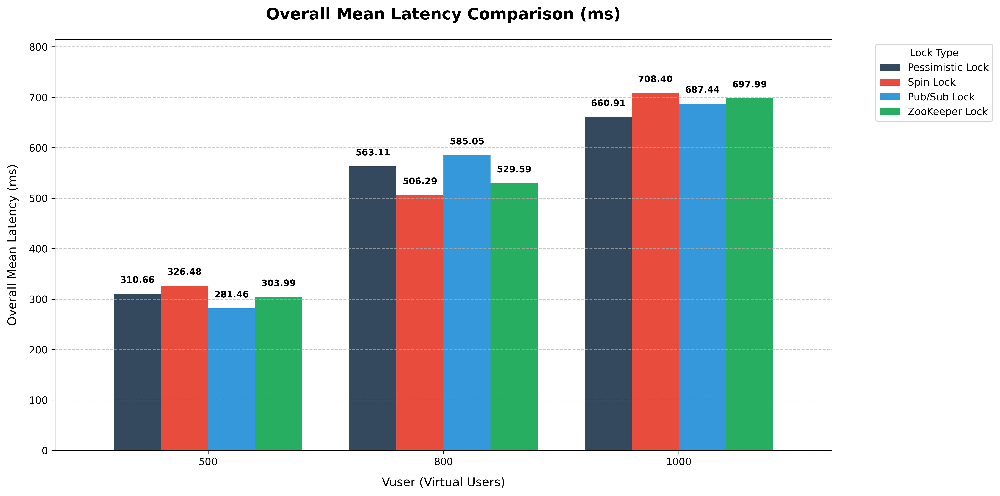
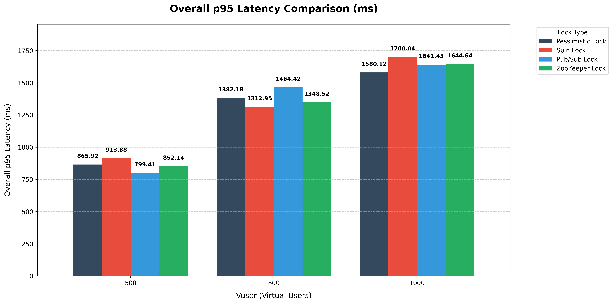

# 응답 지연 시간(Latency) 및 p95 분석 보고서

본 문서는 동시성 제어(Concurrency Control) 방식(Pessimistic Lock, Spin Lock, Pub/Sub Lock)에 따른 응답 지연 시간(Mean Latency)과 꼬리 지연 시간(p95
Tail Latency)을 분석한 결과입니다. 본 데이터는 앞서 진행된 `TPS 분석 보고서`와 교차 검증하여 작성되었습니다.

---

## 1. 종합 지표 요약

|         Lock         | Vuser | Worst Mean Latency | Overall Mean Latency | Best Mean Latency | Average p95 Latency |
| :------------------: | :---: | :----------------: | :------------------: | :---------------: | :-----------------: |
| **Pessimistic Lock** |  500  |       673.77       |        310.66        |       88.50       |       865.92        |
|                      |  800  |       856.13       |        563.11        |      286.06       |       1382.18       |
|                      | 1000  |      1065.27       |        660.91        |      323.46       |       1580.12       |
|    **Spin Lock**     |  500  |       533.57       |        326.48        |      149.11       |       913.88        |
|                      |  800  |       885.15       |        506.29        |      223.15       |       1312.95       |
|                      | 1000  |      1171.84       |        708.40        |      302.25       |       1700.04       |
|   **Pub/Sub Lock**   |  500  |       645.38       |        281.46        |       69.41       |       799.41        |
|                      |  800  |       935.89       |        585.05        |      266.06       |       1464.42       |
|                      | 1000  |       942.57       |        687.44        |      444.21       |       1641.43       |
|  **Zookeeper Lock**  |  500  |       629.45       |        303.99        |       87.17       |       852.14        |
|                      |  800  |       898.01       |        529.59        |      192.78       |       1348.52       |
|                      | 1000  |       988.83       |        697.99        |      423.26       |       1644.64       |

---

## 2. Lock 별 성능 분석

### Pessimistic Lock

- **성능 요약:** 극한의 부하(Vuser 1000) 상황에서 **가장 짧고 안정적인 지연 시간(Mean & p95)** 보여줌
- **상세 분석:**
  - Vuser 500에서는 평범한 지연 시간(310.66ms)을 보였으나, Vuser 1000 구간에서는 Overall Mean 660.91ms, Average p95 1580.12ms로 **4개 전략 중
    지연 시간이 가장 낮게(우수하게) 측정**됨
  - 외부(Redis 등)와의 추가적인 네트워크 통신 없이 데이터베이스 내부의 트랜잭션 대기 큐를 활용하므로, 트래픽이 폭주하는 상황에서도 락 대기 시간이 가장 예측 가능하고 안정적으로 통제됨을 확인할 수 있음

### Spin Lock

- **성능 요약:** 중부하(Vuser 800)까지는 효율적이나, 부하가 임계점을 넘으면 지연 시간이 급증하여 **최악의 꼬리 지연 시간(Tail Latency)** 발생시킴
- **상세 분석:**
  - Vuser 800 구간에서는 Overall Mean 506.29ms로 가장 빠른 응답 속도를 기록함
  - 그러나 Vuser 1000 구간에 진입하자 Mean 708.40ms, p95 1700.04ms로 성능이 급격히 추락하며 **전체 전략 중 가장 느린 지연 시간** 기록
  - 동시 접속자가 많아질수록 락을 획득하지 못한 수많은 스레드가 Redis에 지속적으로 재시도 요청을 보내게 되며, 이로 인한 네트워크 경합과 CPU 오버헤드가 극심한 응답 지연(특히 하위 5%의 p95
    사용자에게 치명적) 유발

### Pub/Sub Lock

- **성능 요약:** 저부하(Vuser 500)에서 **가장 빠른 응답 속도**를 보이며, 고부하에서도 준수한 지연 시간 유지
- **상세 분석:**
  - Vuser 500 구간에서는 Overall Mean 281.46ms, Average p95 799.41ms로 **압도적인 1위** 기록
  - 락 해제 시 이벤트를 받아 즉시 스레드를 깨우는 구조의 장점이 가장 잘 드러난 구간
  - Vuser 1000에서는 지연 시간(Mean 687.44ms, Average p95 1641.43ms)이 Pessimistic Lock보다 근소하게 높게 측정됨
  - Pub/Sub Lock의 처리량(Throughput)이 가장 높았던 점을 고려하면, 더 많은 트랜잭션을 처리하는 과정에서 Redis 이벤트 발행/구독 채널의 부하로 인해 개별 응답 시간은 살짝 증가한
    것으로 분석됨

### Zookeeper Lock

- **성능 요약:** 네트워크 통신과 노드 관리 오버헤드로 인해 일관되게 높은 지연 시간 보여줌
- **상세 분석:**
  - Vuser 1000 구간에서 Mean 697.99ms, p95 1644.64ms를 기록하며 Spin Lock 다음으로 높은 지연 시간 보였음
  - Zookeeper 특성상 락을 획득하고 해제할 때마다 임시 노드를 생성/삭제해야 하며, 클러스터 간 동기화 작업이 수반되므로 고부하 트랜잭션 환경에서는 기본적으로 깔려있는 '최소 응답 지연 시간' 자체가
    높게 형성됨

---

## 3. 결론 및 인사이트

1. **안정적인 사용자 경험(UX) 보장은 Pessimistic Lock:**
   - 극한의 부하(Vuser 1000)에서 하위 5% 사용자가 겪는 최대 지연 시간(p95)이 가장 낮은 방식은 RDBMS의 비관적 락(1580.12ms)
   - 시스템 처리량(TPS)은 Pub/Sub이 1위였으나 **가장 늦게 응답받는 사용자의 대기 시간을 최소화(Fail-safe)** 하는 데에는 외부 의존성이 없는 DB 락이 가장 안정적임
2. **Spin Lock의 'Polling 폭풍' 위험성 증명:**
   - 부하가 적을 때는 Spin Lock이 빠를 수 있으나 Vuser 1000에서 관찰된 1700.04ms의 p95 지연 시간은 시스템 설계 시 Spin Lock 사용을 지양해야 하는 이유를 명확히 보여줌
   - 트래픽 스파이크 시 무한 루프에 가까운 재시도가 발생해 전체 시스템 장애로 이어질 수 있음
3. **최적의 밸런스, Pub/Sub Lock:**
   - Pub/Sub Lock은 Vuser 500 구간에서 가장 빠른 응답 시간(281.46ms)을 보였으며, Vuser 1000 구간에서도 매우 준수한 응답 시간 보여줌
   - TPS 처리량(1위)과 지연 시간(2위)을 종합적으로 고려했을 때, **대규모 트래픽을 감당하는 선착순 이벤트 시스템의 동시성 제어 기술로 가장 훌륭한 밸런스** 제공
4. **p95 Tail Latency의 교훈:**
   - 모든 Lock 전략에서 Overall Mean(평균 지연 시간)은 660~700ms 수준이었으나 p95 꼬리 지연 시간은 평균의 약 2.3배~2.5배인 1580~1700ms에 달함
   - 이는 동시성 제어 환경에서 평균 지연 시간만 보는 것은 위험하며, 락 획득 경쟁에서 밀린 5%의 사용자가 겪는 **심각한 꼬리 지연 현상(Tail Latency Problem)** 고려하여 시스템
     타임아웃(Timeout) 시간을 설정해야 함 시사
