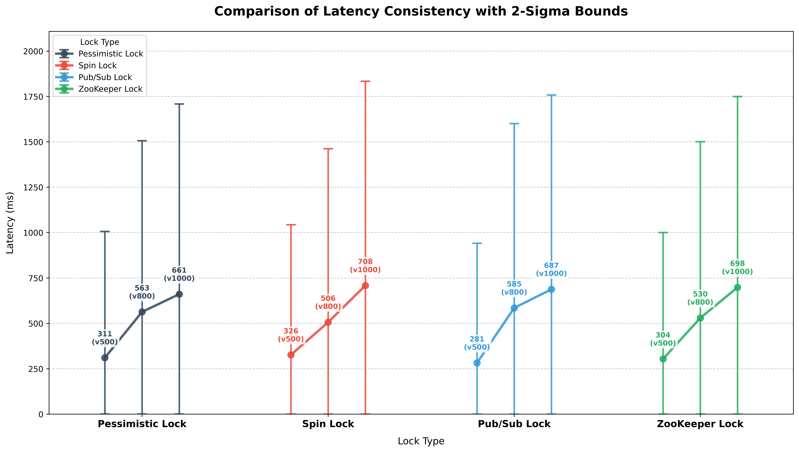

# 시스템 안정성(Stability) 및 2-Sigma 신뢰 구간 분석 보고서

본 문서는 동시성 제어(Concurrency Control) 방식에 따른 응답 지연 시간의 표준편차(Standard Deviation)와 2-Sigma(약 95.4%) 신뢰 구간을 분석하여, 시스템의 **예측 가능성(Predictability)**과 **안정성(Stability)**을 평가한 결과입니다.

---

## 1. 종합 지표 요약

|         Lock         | Vuser | Overall Mean Latency | Avg Total Sigma | Avg Lower Bound | Avg Upper Bound |
| :------------------: | :---: | :------------------: | :-------------: | :-------------: | :-------------: |
| **Pessimistic Lock** |  500  |        310.66        |     317.92      |      0.00       |     946.50      |
|                      |  800  |        563.11        |     444.61      |      0.00       |     1452.32     |
|                      | 1000  |        660.91        |     495.26      |      0.00       |     1651.43     |
|    **Spin Lock**     |  500  |        326.48        |     335.98      |      0.00       |     998.44      |
|                      |  800  |        506.29        |     445.13      |      0.00       |     1396.56     |
|                      | 1000  |        708.40        |     534.09      |      0.00       |     1776.57     |
|   **Pub/Sub Lock**   |  500  |        281.46        |     298.44      |      0.00       |     878.34      |
|                      |  800  |        585.05        |     479.22      |      0.00       |     1543.50     |
|                      | 1000  |        687.44        |     512.51      |      0.00       |     1712.46     |
|  **Zookeeper Lock**  |  500  |        303.99        |     314.25      |      0.00       |     932.50      |
|                      |  800  |        529.59        |     450.18      |      0.00       |     1429.94     |
|                      | 1000  |        697.99        |     507.29      |      0.00       |     1712.57     |

---

## 2. Lock 별 안정성 분석

### Pessimistic Lock

- **성능 요약:** 고부하(Vuser 1000) 환경에서 **가장 낮은 변동성(표준편차)과 가장 안정석인 상한선(Upper Bound)** 보여줌
- **상세 분석:**
  - Vuser 1000 구간에서 평균 표준편차(Avg Total Sigma)는 495.26으로 4개 전략 중 가장 낮았으며, 상위 $2\sigma$(약 95.4%의 사용자가 경험하는 최대 지연 시간) 역시 1651.43ms로 가장 우수하게(낮게) 나타남
  - 이는 데이터베이스 엔진 레벨의 큐잉 메커니즘이 외부 네트워크나 애플리케이션 레벨의 경합보다 훨씬 일관되고 예측 가능한 순서 보장을 제공함을 의미함
  - 트래픽 폭주 시 응답 시간의 '튀는' 현상이 가장 적음

### Spin Lock

- **성능 요약:** 부하가 증가함에 따라 지연 시간의 편차가 걷잡을 수 없이 커지며, **가장 불안정한 시스템 동작** 보임
- **상세 분석:**
  - Vuser 800까지는 표준편차 445.13으로 준수한 안정성을 보였으나, Vuser 1000에 도달하자 표준편차가 534.09로 급증하였고 상한선은 1776.57ms까지 치솟았음
  - 수많은 스레드가 락을 획득하기 위해 Redis에 쉴 새 없이 요청을 보내는 과정에서 심각한 경합이 발생하며 운 좋게 빨리 락을 획득하는 스레드와 끊임없이 밀려나는 스레드 간의 편차가 극단적으로 벌어짐을 알 수 있음

### Pub/Sub Lock

- **성능 요약:** 저부하(Vuser 500)에서는 가장 안정적이나 부하가 한계에 달하면 편차가 다소 증가함
- **상세 분석:**
  - Vuser 500 구간에서는 표준편차 298.44, 상한선 878.34ms를 기록하며 4가지 방식 중 압도적으로 예측 가능한(가장 편차가 적은) 성능 보임
  - 그러나 Vuser 1000 구간에서는 상한선이 1712.46ms로 치솟아 비관적 락(1651.43ms)보다 변동성이 커짐
  - 초당 트랜잭션 처리량(TPS)이 가장 높은 방식인 만큼, 처리량이 극대화되는 시점에서 Redis의 이벤트 발행 및 구독 채널에 부하가 가중되어 스레드가 깨어나는 타이밍의 편차가 발생한 것으로 분석됨

### Zookeeper Lock

- **성능 요약:** 전 구간에서 무난한 안정성을 유지하지만 노드 동기화 오버헤드로 인해 일정한 수준의 높은 편차 가짐
- **상세 분석:**
  - Vuser 1000 구간에서 표준편차 507.29, 상한선 1712.57ms 기록함
  - Pub/Sub Lock과 거의 유사한 변동성 지표 보임
  - 분산 코디네이터로서 강력한 순서 보장 기능(Suquential Node 등)을 제공하여 Spin Lock처럼 극단적으로 변동성이 폭발하지는 않지만, 임시 노드 생성 및 클러스터 간 동기화에 수반되는 고정적인 네트워크 비용 탓에 비관적 락 만큼의 촘촘한 안정성을 확보하지는 못함

---

## 3. 결론 및 인사이트

1. **최고의 예측 가능성(Predictability), Pessimistic Lock:**
   - 하위 5%의 사용자가 극단적인 대기 시간을 겪지 않도록 응답 시간을 일정하게 통제해야 하는 시스템이라면 평균 지연 시간의 편차가 가장 좁게 유지되는 Pessimistic Lock이 가장 훌륭한 선택지
2. **Spin Lock의 위험성(불안정성) 재확인:**
   - Spin Lock은 부하가 임계점을 넘는 순간 편차가 기하급수적으로 벌어짐
   - 이는 시스템 리소스 낭비뿐만 아니라 특정 사용자는 매우 빠르게 응답을 받고 어떤 사용자는 무한정에 가깝게 대기하는 '공정성(Fairness) 훼손' 문제를 야기하므로 고부하 선착순 시스템에서는 사용을 지양해야 함
3. **부하 수준에 따른 Pub/Sub의 양면성:**
   - Vuser 500 수준의 트래픽에서는 Pub/Sub Lock이 지연 시간과 안정성 모두에서 압도적인 1위를 기록함
   - 하지만 극한의 부하에서는 Redis 이벤트 루프의 병목으로 인해 변동성이 커짐
   - 따라서 시스템의 예상 최대 트래픽 규모에 따라 Pub/Sub Lock 적용 여부를 전략적으로 결정해야 함
4. **평균(Mean)의 함정과 타임아웃(Timeout) 설계 가이드:**
   - 모든 Lock 방식에서 전체 평균(Overall Mean Latency)은 600~700ms 대에 형성되었지만 $2\sigma$ 상한선(95.4%의 사용자 커버)은 평균의 약 2.5배인 1650~1770ms에 달함
   - 이는 동시성 제어가 적용된 API를 설계할 때, 클라이언트의 타임아웃(Read Timeout) 시간을 단순 '평균 지연 시간'에 맞춰 짧게 설정하면 대규모 타임아웃 장애가 발생할 수 있음을 강력히 시사함
   - 타임아웃은 반드시 $2\sigma$ 상한선 이상의 넉넉한 값(약 2초 이상)으로 설계되어야 함
