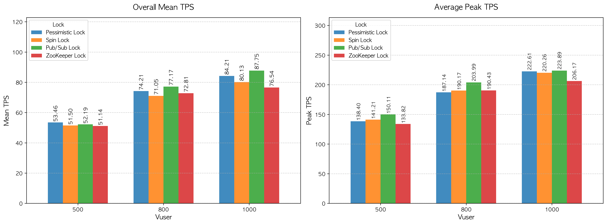

# TPS(Transactions Per Second) 성능 분석 보고서

본 문서는 동시성 제어(Concurrency Control) 방식(Pessimistic Lock, Spin Lock, Pub/Sub Lock)에 따른 시스템의 초당 트랜잭션 처리량(TPS)을 비교 및 분석한 결과입니다. 테스트는 각 락 방식과 가상 사용자(Vuser) 수(500, 800, 1000)에 따라 각각 5회씩 진행되었습니다.

---

## 1. 종합 지표 요약

|         Lock         | Vuser | Worst Mean TPS | Overall Mean TPS | Best Mean TPS | Average Peak TPS |
| :------------------: | :---: | :------------: | :--------------: | :-----------: | :--------------: |
| **Pessimistic Lock** |  500  |     41.67      |      53.46       |     62.50     |      138.40      |
|                      |  800  |     57.07      |      74.21       |    100.00     |      187.14      |
|                      | 1000  |     62.50      |      84.21       |    125.00     |      222.61      |
|    **Spin Lock**     |  500  |     41.58      |      51.50       |     83.33     |      141.21      |
|                      |  800  |     50.00      |      71.05       |    133.17     |      190.17      |
|                      | 1000  |     55.56      |      80.13       |    125.00     |      220.26      |
|   **Pub/Sub Lock**   |  500  |     41.67      |      52.19       |     83.33     |      150.11      |
|                      |  800  |     49.94      |      77.17       |    100.00     |      203.99      |
|                      | 1000  |     50.00      |      87.75       |    125.00     |      223.89      |
|  **Zookeeper Lock**  |  500  |     41.58      |      51.14       |     83.33     |      133.82      |
|                      |  800  |     50.00      |      72.81       |    100.00     |      190.43      |
|                      | 1000  |     55.50      |      76.54       |    100.00     |      206.17      |

---

## 2. Lock 별 성능 분석

### Pessimistic Lock

- **성능 요약:** 외부 인프라(Redis 등) 없이도 상당히 우수하고 안정적인 성능 증가폭을 보여줌
- **상세 분석:**
  - Vuser가 500에서 1000으로 증가함에 따라 Overall Mean TPS가 53.46에서 84.21로 상승하였고, Average Peak TPS 또한 138.40에서 222.61로 비례하여 증가함
  - DB 자체의 락 메커니즘을 사용하므로 고부하 상황(Vuser 1000)에서도 Spin Lock(80.13)이나 Zookeeper Lock(76.54)보다 높은 평균 처리량을 유지하며 훌륭한 방어력과 안정성 입증함

### Spin Lock

- **성능 요약:** 고부하 환경으로 갈수록 지속적인 재시도(Polling) 오버헤드로 인해 성능 상승폭이 둔화됨
- **상세 분석:**
  - Vuser 500에서는 평균 TPS 51.50으로 타 방식과 유사한 출발을 보였으나, Vuser 1000에서는 평균 80.13을 기록하여 Pessimistic Lock 및 Pub/Sub Lock 대비 낮은 성능 기록함
  - 락 획득을 위해 지속적으로 Redis에 요청을 보내는 방식으므로 가상 사용자가 늘어날수록 네트워크 및 Redis 서버 자체에 경합 비용이 누적되어 처리량 확장에 병목이 발생함 알 수 있음

### Pub/Sub Lock

- **성능 요약:** 고부하(Vuser 800, 1000) 환경에서 **가장 압도적인 초당 처리량** 달성
- **상세 분석:**
  - Vuser 1000 구간에서 Overall Mean TPS 87.75, Average Peak TPS 223.89를 기록하며 4가지 동시성 제어 방식 중 1위 차지함
  - 락 해제 이벤트를 구독하여 대기 중인 스레드를 깨우는 방식을 사용하므로, Spin Lock과 같은 무의미한 반복 요청 오버헤드가 제거되어 부하가 극한으로 몰리는 상황에서 효율성이 가장 극대화됨

### Zookeeper Lock

- **성능 요약:** 데이터 일관성 보장에는 강력하나, 높은 빈도의 트랜잭션 환경에서는 가장 낮은 처리량 보임
- **상세 분석:**
  - Vuser 1000 구간에서 Overall Mean TPS 76.54, Average Peak TPS 206.17을 기록하여 4가지 방식 중 성능이 **가장 저조**함
  - Zookeeper 특성상 분산 노드 간의 합의와 임시 노드 생성/삭제 과정에서 발생하는 네트워크 비용이 크기 때문에, 수강신청과 같이 짧은 시간에 대량의 락 획득/해제가 일어나는 시나리오에서는 시스템 처리량을 떨어뜨리는 주된 원인이 됨

---

## 3. 결론 및 인사이트

1. **대규모 선착순 트랜잭션의 최적해, Pub/Sub Lock:**
   - Vuser 800 이상의 강한 부하가 발생할 때 처리량(Mean/Peak TPS)이 가장 높은 방식은 Redis의 Pub/Sub Lock
   - 불필요한 트래픽 경합을 줄여 시스템 리소스를 실제 트랜잭션 처리에 온전히 집중시킬 수 있으므로, 고성능이 요구되는 환경에서 가장 적합한 전략임
2. **Pessimistic Lock의 재발견 (비용 대비 고효율):**
   - 단순한 DB 락킹 방식임에도 Vuser 1000에서 평균 TPS 84.21을 기록하며 전체 2위의 훌륭한 성능 보여줌
   - 만약 시스템 아키텍처에 Redis나 Zookeeper 같은 외부 캐시/조율 인프라를 추가할 여력이 없다면, RDBMS의 Pessimistic Lock만으로도 충분히 강력하고 안정적인 동시성 제어가 가능함 시사
3. **Spin Lock의 스케일링 한계 확인:**
   - Spin Lock은 Vuser가 낮을 때는 유효할 수 있으나, Vuser 1000과 같은 극한의 부하에서는 수많은 스레드가 동시에 락 획득을 시도하며 발생하는 '네트워크 폭격'으로 인해 평균 성능이 80.13에 머물렀음
   - 부하가 커질수록 효율이 급감하는 구조적 한계가 명확히 드러남
4. **목적에 맞지 않는 Zookeeper 도입의 위험성:** 분산 시스템 제어에 특화된 Zookeeper는 마이크로서비스 간의 굵직한 분산 락 관리나 리더 선출에는 유리하지만, 단일 애플리케이션 내의 초고속 선착순 트랜잭션 제어 용도로 사용할 경우 무거운 프로토콜 오버헤드 탓에 오히려 시스템 전반의 TPS를 깎아먹는 결과 초래함
